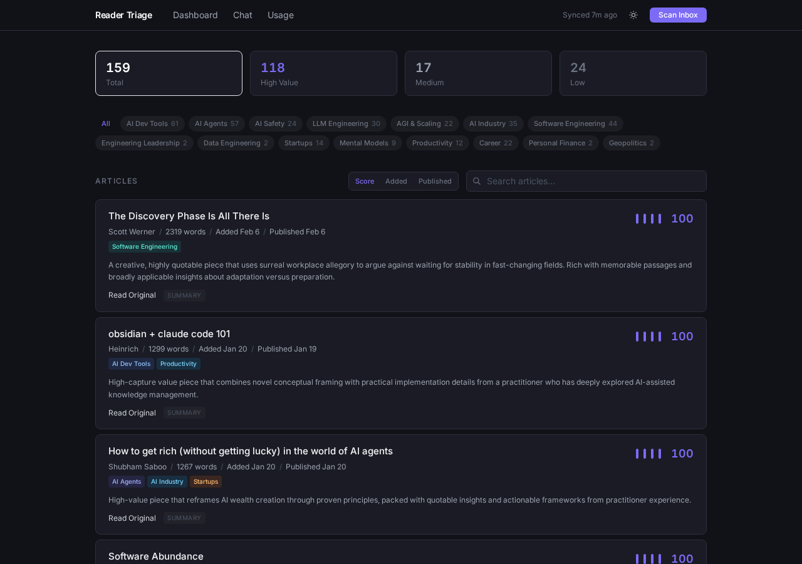
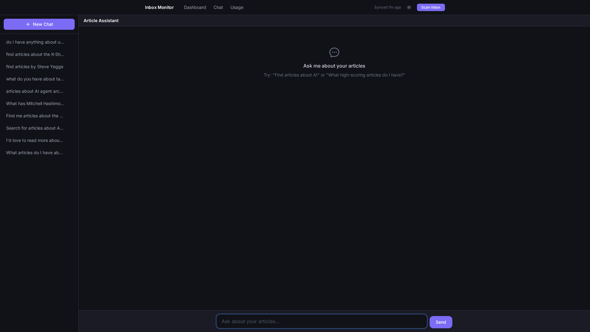

# Reader Triage

[](https://github.com/EvanOman/reader-triage/actions/workflows/ci.yml)


A self-hosted tool that watches your [Readwise Reader](https://readwise.io/read) inbox and scores articles using Claude, so you can focus on the ones worth reading.



## What it does

Reader Triage periodically syncs your Readwise Reader inbox and runs each article through a Claude-based scoring pipeline. Articles are scored 0-100 across four dimensions that predict whether you'd actually highlight or save passages from the piece: quotability, surprise factor, argument quality, and applicable insight. High-scoring articles surface to the top; low-scoring ones get auto-summarized so you can archive them without guilt.

The scoring model is calibrated against real highlight data. Authors you've historically engaged with get a boost. Articles are tagged into topics (AI, software engineering, economics, etc.) with color-coded badges for quick filtering.

A chat interface lets you search and explore your article library using natural language. The chat agent has access to both keyword search (FTS5) and semantic search (Qdrant vectors), fused with Reciprocal Rank Fusion, so queries like "articles about taste in software" find relevant results even when the exact words don't match.



## How it works

### Scoring

The scoring pipeline fetches each article's full content from Readwise, strips HTML, and sends it to Claude with a structured prompt that returns categorical assessments (e.g., "how many standalone quotable passages: none / a_few / several / many"). These categories map to numeric scores, which sidesteps the problem of LLMs being bad at picking numbers directly. The system also detects stub content (paywalls, truncated feeds) and marks those articles for re-scoring later.

The scoring dimensions were calibrated against actual reading behavior: article content is the independent variable, and the number of highlights the reader made in each article is the dependent variable. The goal is to predict which articles you'd actually engage with — not which ones sound important. This isn't a trained ML model; it's a heuristic that Claude evaluates, but the rubric and category-to-point mappings were tuned by analyzing the correlation between scores and real highlight rates across a corpus of previously read articles. Authors you've historically highlighted frequently get a priority boost on top of the content score. A calibration toolkit (`backtest/`, `tools/cal_*.py`) provides Spearman correlations, tier accuracy, dimension analysis, and miss analysis to refine the rubric over time.

### Search

Search is hybrid: FTS5 handles keyword matching with BM25 weighting (title 10x, author 5x, body 1x), while Qdrant stores sentence-transformer embeddings for semantic similarity. Results from both are merged using RRF (`1/(60+rank)` per ranking, summed). The chat agent sees a single `search` tool and can choose keyword-only, semantic-only, or hybrid mode per query.

Article content is stored locally in SQLite after first fetch, so the chat agent's `read_article_content` tool can serve content from the database instead of hitting the Readwise API every time.

## Setup

```bash
git clone https://github.com/EvanOman/reader-triage.git
cd reader-triage
uv sync
cp .env.example .env
# Edit .env with your API keys
```

You need:
- A [Readwise Reader](https://readwise.io/read) account and API token
- An [Anthropic](https://console.anthropic.com/) API key

## Running

```bash
just dev  # Starts dev server on port 19000
```

Open `http://localhost:19000` in your browser.

To populate data, click "Scan Inbox" in the top nav. This fetches articles from your Readwise inbox and scores them with Claude. Initial scoring of a full inbox will take a few minutes and use API credits.

## Development

```bash
just dev          # Dev server with hot reload
just fc           # Format, lint, type-check, test (the full CI check)
just test         # Run tests only
just fmt          # Format with ruff
just lint         # Lint with ruff
just type         # Type-check with ty
```

## Architecture

```
app/
  main.py                  # FastAPI app, lifespan, middleware
  config.py                # Settings from environment
  tracing.py               # OpenTelemetry setup
  models/
    article.py             # SQLAlchemy models, FTS5 index, migrations
  routers/
    api.py                 # REST API (scan, score, tag, chat threads)
    chat.py                # Chat SSE endpoint
    pages.py               # Dashboard, chat, usage HTML pages
  services/
    scorer.py              # Claude scoring pipeline
    summarizer.py          # Auto-summary for low-score articles
    tagger.py              # Topic tagging via Claude
    chat.py                # Chat agent with tool use and hybrid search
    vectorstore.py         # Qdrant wrapper, embedding, search
    readwise.py            # Readwise Reader API client
    authors.py             # Author highlight stats for boost scoring
    sync.py                # Background sync scheduler
    usage.py               # API usage tracking
  templates/               # Jinja2 HTML templates
tests/                     # 166 tests (models, scorer, chat, API)
tools/                     # CLI utilities (backfill, calibration, embedding)
backtest/                  # Scoring calibration scripts
docs/                      # Calibration guide, screenshots
```

## Stack

- **[FastAPI](https://fastapi.tiangolo.com/)** + **[SQLAlchemy](https://www.sqlalchemy.org/)** async + **[aiosqlite](https://github.com/omnilib/aiosqlite)** -- async web framework with SQLite
- **[Anthropic SDK](https://docs.anthropic.com/)** -- Claude for scoring, summarization, tagging, and chat
- **[Qdrant](https://qdrant.tech/)** + **[sentence-transformers](https://www.sbert.net/)** -- local vector search with `nomic-embed-text-v1.5`
- **SQLite FTS5** -- full-text keyword search with BM25 ranking
- **[Jinja2](https://jinja.palletsprojects.com/)** + **[Tailwind CSS](https://tailwindcss.com/)** (CDN) -- server-rendered UI
- **[readwise-plus](https://pypi.org/project/readwise-plus/)** -- Readwise Reader API client
- **[ruff](https://docs.astral.sh/ruff/)** + **[ty](https://docs.astral.sh/ty/)** + **[pytest](https://docs.pytest.org/)** -- linting, type checking, testing

## Configuration

See [`.env.example`](.env.example) for all environment variables.

| Variable | Required | Description |
|---|---|---|
| `READWISE_TOKEN` | Yes | Readwise Reader API token |
| `ANTHROPIC_API_KEY` | Yes | Anthropic API key for Claude |
| `DATABASE_URL` | No | SQLite path (default: `./reader_triage.db`) |
| `ROOT_PATH` | No | URL prefix for reverse proxy deployment |
| `OTLP_ENDPOINT` | No | OpenTelemetry collector (default: `http://localhost:4317`) |

## Note on authentication

This application has no built-in authentication. It's designed for single-user deployment on a trusted network (e.g., behind Tailscale). Do not expose it to the public internet without adding an auth layer.

## License

[MIT](LICENSE)
